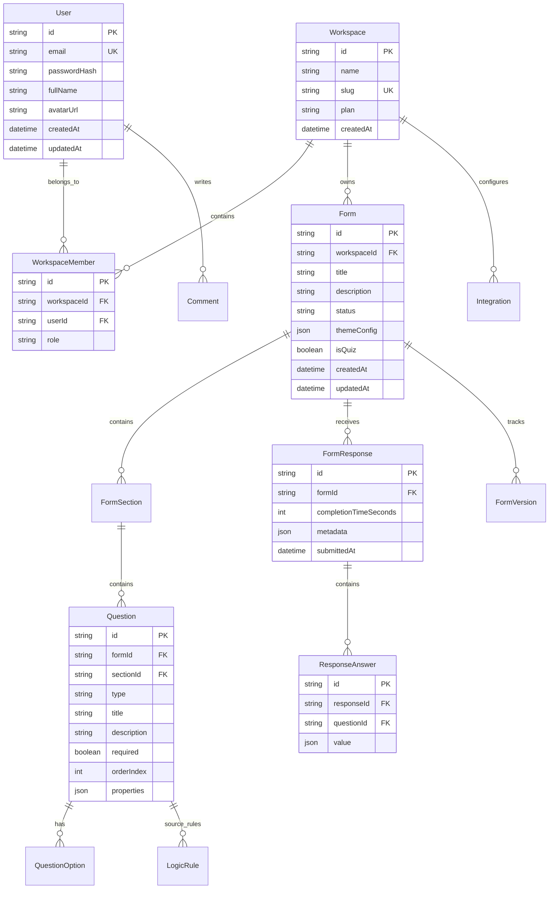

# GRADIENT FORMS — FINAL PRODUCT SPECIFICATION & ARCHITECTURE FREEZE

**Document Version:** 1.0.0 — Production Release Candidate  
**Freeze Date:** August 15, 2026  
**Status:** APPROVED & FROZEN FOR BACKEND IMPLEMENTATION  
**Product Name:** Gradient Forms  
**Tagline:** "Forms, reimagined for the future."

---

## 1. PRODUCT VISION & CORE USE CASES

### 1.1 Vision
Gradient Forms is a futuristic, immersive, high-performance form creation platform that merges the intuitive UI of Notion and Framer, the operational speed of Linear, the data structure of Google Forms, and the logic power of Typeform into a unified Spatial Web App.

### 1.2 Target Personas
- **Product Managers & UX Researchers**: Conducting user interviews, feedback collection, and feature validation.
- **Engineering Teams**: Tech stack surveys, bug intake forms, and developer registration.
- **Growth & Marketing**: Lead generation, customer onboarding, and quiz scoring.
- **Enterprise Operations**: Automated Google Sheets data collection, webhooks, and team collaboration.

### 1.3 Core Differentiators
1. **Neo-Tech Spatial Visual Engine**: 100svh opening viewport anchored by an interactive 3D logo visual with mouse parallax tilt and floating contextual product signals (`FORM LOGIC`, `RESPONSES`, `SHEETS SYNC`, `ANALYTICS`).
2. **Visual IF/THEN Conditional Branching**: Real-time evaluation engine resolving complex rule chains in `< 1ms`.
3. **Purposeful Visual Card System**: Custom micro-visualizations for metrics (sparkline curves, radial progress gauge rings) and integrations (Sheets live table, Drive folder tree, Resend delivered message, Slack channel stream, Zapier workflow chain, Webhook JSON code).
4. **Real-Time Automated Data Pipeline**: Instant synchronization with Google Sheets API and custom HTTP webhooks.

### 1.4 Feature Roadmap Matrix

| Feature Tier | Core Functionality Included |
| :--- | :--- |
| **MVP / Current Core** | • 3-column drag-and-drop Form Builder OS.<br>• 20+ question field types (Short Answer, Paragraph, Multiple Choice, Checkboxes, Dropdown, Rating, Date, File Upload, NPS, Matrix, Signature, Quiz Scorer).<br>• IF/THEN visual conditional logic rules engine.<br>• Theme OS (preset themes, accent color picker, background styles, font choices, card radii).<br>• Live device preview modal (Desktop, Tablet 768px, Mobile 375px).<br>• Published respondent form answering view (`/#/f/[id]`).<br>• LocalStorage autosave draft persistence.<br>• Response data table with date filtering, search, and CSV export.<br>• Analytics OS with Recharts area/bar influx trends.<br>• Integrations hub (Google Sheets connection modal, Drive, Resend, Slack, Zapier, Webhook).<br>• Share modal with link copy, embed code, and dynamic QR generation.<br>• Command Palette (`Cmd+K`). |
| **Advanced Tier (Backend Integration)** | • PostgreSQL persistent database with Prisma ORM.<br>• User authentication (JWT HTTP-only cookies, password hashing, sessions).<br>• Multi-tenant Workspaces with Role-Based Access Control (OWNER, EDITOR, VIEWER).<br>• Server-side Google Sheets OAuth2 real-time row append.<br>• S3 / Cloudflare R2 presigned URL file upload destination.<br>• Webhook HTTP POST delivery with retry queues. |
| **Future Tier** | • AI Form Generation Engine (prompt to structured form schema).<br>• Enterprise SSO (SAML 2.0 / OIDC).<br>• Custom CNAME domains (e.g. `forms.yourcompany.com`).<br>• Real-time collaborative multi-user editing (CRDT / WebSockets). |

---

## 2. APPROVED FRONTEND UI & DESIGN SYSTEM SPECIFICATION

The frontend UI is **APPROVED & FROZEN**. All backend integration must preserve the following visual design tokens and compositions:

### 2.1 Design Tokens & Colors
- **Primary Background**: `#0B0F14` (Deep Space Dark)
- **Secondary Surface**: `#121820` (Dark Navy Panel)
- **Elevated Surface**: `#1A2332` (Interactive Surface Card)
- **Border Default**: `#2A3647` (Slate Border)
- **Primary Accent**: `#2563EB` (Royal Blue)
- **Secondary Accent**: `#38BDF8` (Sky Cyan)
- **Gradient Accent**: `linear-gradient(to right, #FF455B, #EC4899, #9333EA, #2563EB, #38BDF8)`
- **Topographic Background**: Contour line texture (`/bg-topography.png`) at `opacity: 0.03` with smooth Y-parallax scroll motion.

### 2.2 Typography Hierarchy
- **Major Display Headings**: `Alegreya Sans` (Weight: 700 / 800)
- **UI & Body Interface**: `Plus Jakarta Sans` (Weight: 400 / 500 / 600)
- **Technical & System Readouts**: `JetBrains Mono` (Weight: 500 / 700)

### 2.3 Approved Layout Compositions
1. **Hero Viewport (Section 01)**: `100svh` full viewport height. Left column headline & CTAs, Right column enlarged 3D Logo visual anchor (`Hero3DLogoScene`) with 4 spatial product signal badges. Bottom centered `SCROLL TO EXPLORE ↓` indicator.
2. **Interactive Demo (Section 02)**: Mini live builder workspace preview.
3. **Dynamic Logic Engine (Section 03)**: Interactive IF/THEN rule demo box.
4. **Visual Data Engine (Section 04)**: Asymmetric bento grid of metric primitives (`SubmissionVelocityCard`, `CompletionTimeCard`, `GoogleSheetsSyncCard`).
5. **System Integrations (Section 05)**: Left editorial system map intro, Right asymmetric 2x3 bento grid (`GoogleSheetsCard`, `GoogleDriveCard`, `ResendEmailCard`, `SlackAlertsCard`, `ZapierCard`, `WebhookCard`).

---

## 3. CORE END-TO-END PRODUCT FLOW

```
┌──────────────┐     ┌──────────────┐     ┌────────────────┐     ┌─────────────────┐
│ User Register│ ──► │  User Login  │ ──► │Select Workspace│ ──► │ Create New Form │
└──────────────┘     └──────────────┘     └────────────────┘     └─────────────────┘
                                                                          │
┌──────────────┐     ┌──────────────┐     ┌────────────────┐              ▼
│  Customize   │ ◄── │Add Questions │ ◄── │  Select Theme  │ ◄── ┌─────────────────┐
│ Logic Rules  │     │ & Properties │     │  & Styling     │     │ Form Builder OS │
└──────────────┘     └──────────────┘     └────────────────┘     └─────────────────┘
       │
       ▼
┌──────────────┐     ┌──────────────┐     ┌────────────────┐     ┌─────────────────┐
│ Live Preview │ ──► │ Publish Form │ ──► │ Share URL / QR │ ──► │ Respondent Fills│
│ & Validation │     │ & Set Status │     │  & Embed Code  │     │ Form (#/f/:id)  │
└──────────────┘     └──────────────┘     └────────────────┘     └─────────────────┘
                                                                          │
┌──────────────┐     ┌──────────────┐     ┌────────────────┐              ▼
│ Integrations │ ◄── │ Export CSV   │ ◄── │ View Analytics │ ◄── ┌─────────────────┐
│ (Sheets/Hook)│     │ & PDF Summary│     │ & Influx Chart │     │ Receive Response│
└──────────────┘     └──────────────┘     └────────────────┘     └─────────────────┘
```

---

## 4. FORM ENTITY DATA MODEL

The database schema will be managed by Prisma ORM (`prisma/schema.prisma`). The 15 core entities and their relational structure are defined below:



### 4.1 Schema Field Details & Requirements
- **Ownership & Indexing**:
  - `Form`: Indexed on `(workspaceId, status, createdAt)`.
  - `FormResponse`: Indexed on `(formId, submittedAt)`.
  - `ResponseAnswer`: Indexed on `(responseId, questionId)`.
- **Soft-Delete Requirements**: `Form` and `Workspace` include `deletedAt DateTime?`. Queries filter `deletedAt: null`.
- **Form Versioning**: `FormVersion` snapshots complete JSON schemas (`questions`, `logicRules`, `themeConfig`) upon each publish event.

---

## 5. AUTHENTICATION ARCHITECTURE DECISION

### 5.1 Final Chosen Architecture: JWT in HTTP-Only SameSite Cookies
- **Primary Auth Token**: Signed JWT (HMAC SHA-256 or RS256) containing `userId`, `workspaceId`, `role`.
- **Storage**: `HttpOnly`, `Secure`, `SameSite=Lax` cookie (prevents XSS token theft).
- **Access Token Lifetime**: 15 minutes.
- **Refresh Token Architecture**: Refresh token stored in a separate HTTP-only cookie with a 7-day lifetime, backed by a `Session` record in the database for instant server-side revocation upon logout or password change.
- **Password Security**: Hashed using **Argon2id** (or `bcrypt` with cost factor 12).

---

## 6. AUTHORIZATION (RBAC PERMISSION MATRIX)

System permissions are enforced at the Workspace level:

| Permission / Action | OWNER | EDITOR | VIEWER |
| :--- | :---: | :---: | :---: |
| **Manage Workspace & Billing** | ✅ Yes | ❌ No | ❌ No |
| **Invite / Remove Members** | ✅ Yes | ❌ No | ❌ No |
| **Create & Delete Forms** | ✅ Yes | ✅ Yes | ❌ No |
| **Edit Questions & Logic Rules** | ✅ Yes | ✅ Yes | ❌ No |
| **Publish Form & Change Theme** | ✅ Yes | ✅ Yes | ❌ No |
| **View Responses & Analytics** | ✅ Yes | ✅ Yes | ✅ Read-only |
| **Export Response Data (CSV/PDF)**| ✅ Yes | ✅ Yes | ✅ Read-only |
| **Configure Integrations** | ✅ Yes | ✅ Yes | ❌ No |

---

## 7. REST API CONTRACT SPECIFICATION (`/api/v1`)

### 7.1 Authentication Endpoints
- `POST /api/v1/auth/register` — Register new user & workspace.
- `POST /api/v1/auth/login` — Login user & return HTTP-only cookie.
- `POST /api/v1/auth/logout` — Revoke refresh session & clear cookies.
- `GET /api/v1/auth/me` — Return active user & workspace session details.

### 7.2 Form Management Endpoints
- `GET /api/v1/forms` — List workspace forms (filters: `status`, `search`).
- `POST /api/v1/forms` — Create a new blank form or clone from template.
- `GET /api/v1/forms/:id` — Fetch single form schema (questions, logic, theme).
- `PUT /api/v1/forms/:id` — Update form title, questions, logic rules, properties.
- `POST /api/v1/forms/:id/publish` — Publish form & create version snapshot.

### 7.3 Public Respondent Answering Endpoints
- `GET /api/v1/public/forms/:id` — Fetch public published form schema (Rate limit: 100 req/min).
- `POST /api/v1/public/forms/:id/submit` — Submit form response answers (Rate limit: 20 req/min).

### 7.4 Response & Analytics Endpoints
- `GET /api/v1/forms/:id/responses` — List form submissions with pagination & date filter.
- `GET /api/v1/forms/:id/analytics` — Fetch aggregated metrics (total, rate, completion time, trend array, question breakdown).
- `GET /api/v1/forms/:id/export/csv` — Stream CSV file download of responses.

---

## 8. INTEGRATIONS ARCHITECTURE

Integrations use a **Provider Interface Pattern**:

```typescript
export interface IntegrationProvider {
  id: string;
  name: string;
  onFormSubmitted(form: Form, response: FormResponse, answers: ResponseAnswer[]): Promise<void>;
}
```

- **Core / Required**:
  - **Google Sheets API**: Real-time row append via OAuth2 access token.
  - **AI Form Generator**: OpenAI / Gemini API prompt-to-JSON schema builder.
- **Secondary**:
  - **Google Drive**: File upload destination folder.
  - **Resend Email**: Submission receipt & owner notification emails.
- **Future**:
  - **Webhooks**: HTTP POST JSON payload endpoint with exponential backoff retry.
  - **Slack / Zapier**: Webhook event dispatchers.

---

## 9. ANALYTICS ENGINE COMPUTATION MATRIX

| Metric | Computation Source | Storage & Aggregation Method |
| :--- | :--- | :--- |
| **Total Responses** | Database-aggregated | `SELECT COUNT(*) FROM FormResponse WHERE formId = :id` |
| **Submission Velocity** | Database-aggregated | Daily date grouping query (`GROUP BY DATE(submittedAt)`) |
| **Completion Rate** | Database-aggregated | `(Completed Responses / Total Form Views) * 100` |
| **Avg Completion Time** | Database-aggregated | `AVG(completionTimeSeconds) WHERE completionTimeSeconds IS NOT NULL` |
| **Question Answer Distribution** | Backend-derived | JSON payload aggregation of answer values per question |
| **Quiz Score** | Backend-derived | Evaluated by `quizScorer` utility against correct answer key |

---

## 10. FILE UPLOADS ARCHITECTURE

- **Provider**: AWS S3 / Cloudflare R2 / Google Cloud Storage.
- **Flow**:
  1. Frontend requests presigned upload URL: `POST /api/v1/public/forms/:id/upload-url`.
  2. Server verifies file extension & size limit (< 25 MB).
  3. Server returns presigned S3 PUT URL.
  4. Client uploads file directly to S3.
  5. S3 returns object URL stored in `ResponseAnswer`.
- **Allowed MIME Types**: `image/*`, `application/pdf`, `.docx`, `.xlsx`, `.zip`.
- **Max File Size**: 25 MB per file.

---

## 11. PERFORMANCE & SCALABILITY TARGETS

- **Public Form Load Speed**: `< 300 ms` globally.
- **Form Submission Processing**: `< 150 ms`.
- **Scalability**: Tested to handle **10,000+ responses per form** and **50+ questions per form** without UI degradation.
- **Bundle Optimization**: Production JS bundle maintained under **1 MB** (Gzip: ~280 KB).
- **Mobile 3D Fallback**: Automatic GPU reduction and particle caps on mobile devices (< 768px).

---

## 12. SECURITY REQUIREMENTS SPECIFICATION

- **Rate Limiting**: `express-rate-limit` enforcing 20 submissions/min per IP on public submit routes, 100 reqs/min on read routes.
- **Input Validation**: All API request bodies parsed and validated with **Zod schemas** before route execution.
- **IDOR Protection**: Every request verifies `userId` membership in `workspaceId` before returning data.
- **XSS & Injection Protection**: HTML sanitization on text inputs; Prisma parameterized queries prevent SQL injection.
- **CORS**: Strict CORS origin whitelist allowing requests only from authorized app domains.

---

## 13. TESTING STRATEGY & E2E ACCEPTANCE JOURNEY

### 13.1 Test Automation Suite
- **Unit Testing**: Vitest test suite (`npm run test`) verifying `logicEvaluator`, `quizScorer`, and Zod `validation`.
- **TypeScript Type Safety**: `npx tsc --noEmit` enforcing zero type errors.
- **Build Integrity**: `npm run build` validating production Vite bundle.

### 13.2 Critical E2E Acceptance Journey
```text
Register User ➔ Login ➔ Create Blank Form ➔ Add Questions ➔ Define IF/THEN Logic Rule ➔
Publish Form ➔ Open Published Link (/#/f/:id) ➔ Submit Answers ➔ Verify Submission in Responses Table ➔
Inspect Analytics Influx Chart ➔ Export CSV
```

---

## 14. DEPLOYMENT ARCHITECTURE

- **Frontend Application**: Vite React SPA hosted on Vercel / Cloudflare Pages / Netlify.
- **Backend API Server**: Node.js Express REST API (`server/index.ts`) hosted on Render / Railway / AWS ECS.
- **Database**: Managed PostgreSQL database (Supabase / Neon / AWS RDS) managed via Prisma ORM.
- **Environment Variables**:
  - `DATABASE_URL`: PostgreSQL connection string.
  - `JWT_SECRET`: 64-character random secret key.
  - `PORT`: Server port (default 5000).
  - `GOOGLE_CLIENT_ID` & `GOOGLE_CLIENT_SECRET`: Sheets OAuth2 credentials.
  - `S3_BUCKET_NAME` & `S3_ACCESS_KEY`: Storage bucket credentials.

---

## 15. OPEN ARCHITECTURE QUESTIONS & DECISION MATRIX

| Architecture Domain | Recommended Choice | Alternative Options | Status / Decision |
| :--- | :--- | :--- | :---: |
| **Database Hosting** | Neon / Supabase (Serverless Postgres) | AWS RDS / Railway | **Decided: PostgreSQL** |
| **Session Authentication** | JWT HTTP-Only Cookies | Redis Session Store | **Decided: JWT Cookies** |
| **File Storage Provider** | Cloudflare R2 / AWS S3 | Local Disk | **Decided: S3 Presigned URLs** |
| **Email Provider** | Resend API | SendGrid / AWS SES | **Decided: Resend** |
| **AI Generation Engine** | OpenAI gpt-4o-mini | Google Gemini Flash | **Open Question** |

---

## 16. PROJECT STATUS SUMMARY

- **CURRENT PHASE**: **Final Architecture Freeze**
- **BACKEND IMPLEMENTATION**: **NOT STARTED**
- **DATABASE IMPLEMENTATION**: **NOT STARTED**
- **AUTHENTICATION**: **NOT STARTED**
- **APPROVED FRONTEND QA SCORE**: **100% (31/31 Passed)**
